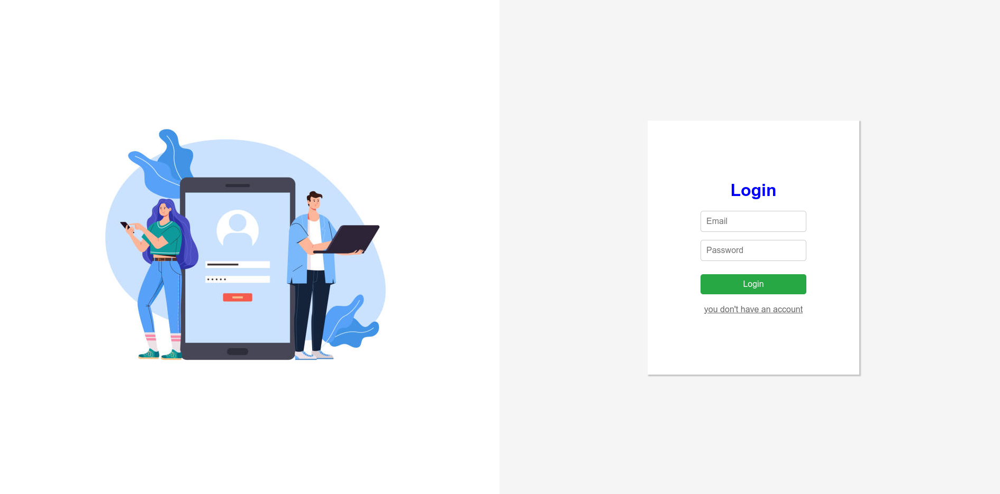

# User Authentication with MERN, CRUD, and Access Tokens
 
 
 

This project is a full-stack application built with the MERN stack (MongoDB, Express, React, Node.js). Its primary goal is to provide a user authentication system using JWT tokens and offer CRUD (Create, Read, Update, and Delete) operations on authenticated users. The application includes session management through an access token, ensuring that only authenticated users can access private routes and functionalities.
[View the live demo](https://mernuservalidatorcrud-production.up.railway.app/login "Live Demo")

## Features

- **User Authentication**: User login and registration with secure password storage using hashing.
- **JWT Token Management**: Tokens are generated upon login and stored on the client for accessing private routes.
- **Protected Routes**: Certain routes are accessible only to authenticated users.
- **User CRUD Operations**: Users can create, read, update, and delete profiles, but only with a valid token.
- **Session Expiration**: The token has a limited lifespan. Once it expires, the user is automatically redirected to the login page.

## Technologies Used

- **MongoDB**: NoSQL database used to store user information.
- **Express**: Node.js framework for handling routes, controllers, and backend logic.
- **React**: JavaScript library used to build the user interface on the frontend.
- **Node.js**: Runtime environment used to run the backend of the project.
- **jsonwebtoken**: Used to create and verify JWT tokens for authentication.

## Prerequisites

- **Node.js**: Required to run the backend.
- **MongoDB**: Database used to store project data.

## Installation

1. Clone this repository:
   ```bash
   git clone https://github.com/Maze000/mernUserValidatorCrud.git
   cd <project-folder>
2. Install project dependencies:
   
   npm install

4. Configure the environment variables in a `.env` file in the project root:


- MONGODB_URI=<your_mongodb_uri>
- SECRET_KEY=<your_secret_key>
- TOKEN_EXPIRATION=1h
## Usage

  - **Start the server** :

   
    npm start
    

- To access CRUD functionalities and protected routes, make sure to authenticate using a valid token. This token is stored on the client after a successful login.

## Main Routes

- **`/logout` (GET)**:  
  Logs the user out by simply sending a success response.

- **`/login` (POST)**:  
  Authenticates the user using email and password. If successful, it generates a JWT token that is returned to the client. The token is used to authenticate future requests.

- **`/signup` (POST)**:  
  Registers a new user. If the registration is successful, a JWT token is generated and returned to the client.

- **`/api/tasks` (GET)**:  
  Fetches all tasks from the database. This route is used to list all existing tasks.

- **`/api/tasks` (POST)**:  
  Creates a new task. The task details are sent in the request body and saved to the database.

- **`/api/tasks/:id` (PUT)**:  
  Updates an existing task by its ID. The task data is updated with the information provided in the request body.

- **`/api/tasks/:id` (DELETE)**:  
  Deletes a task by its ID. If the task is found and deleted successfully, a confirmation message is returned.

## Contributions

Contributions are welcome! If you'd like to improve a feature or fix a bug, feel free to fork the repository and submit a pull request.
